# 類比電表辨識
<p float="left">
  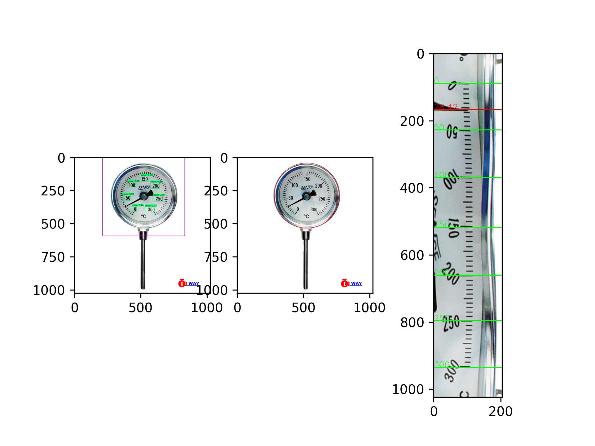
  &emsp;
  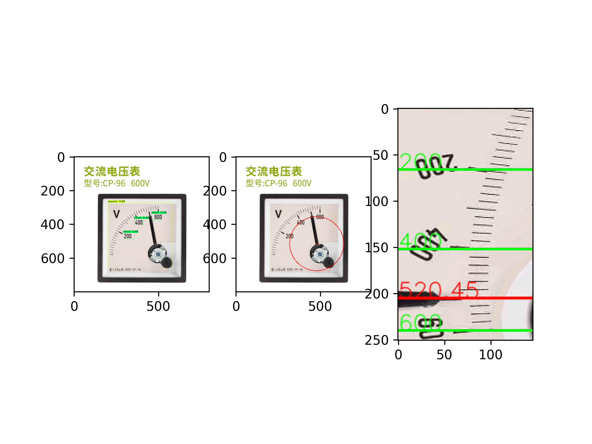
</p>

## 簡介
* 使用 TensorFlow 版的 YOLOv4 訓練模型
* 物件辨識的種類為數值、方形電表、圓形電表
* 主要以極坐標轉換來獲取影像中的刻度、指針
* 計算刻度、指針中心坐標用以推算其距離關係
* 輸入圖片可以辨識類比電表中指針指到的數值

## 套件
```
tensorflow-gpu==2.3.0rc0
opencv-python
lxml
tqdm
absl-py
matplotlib
easydict
pillow
pytesseract
```

## 下載
請下載最新版，將訓練過的模型解壓至專案根目錄並將資料夾命名為 checkpoints/，資料集解壓至 data/
* [Dataset](https://drive.google.com/drive/folders/17GL5mKnMv6qhyP1jZOL7Ub5QfbKR1hHR?usp=sharing)
* [Model](https://drive.google.com/drive/folders/1YPWNaVrifHLVj_yAzJmJnffDFmgr4hQD?usp=sharing)

## 測試
可使用資料集中得圖片作為測試資料
```bash
python detect.py --weights checkpoints\yolov4-analog-ammeter-160 --image test.jpg
```

## 模型訓練
先運行 sctipts/voc/ 中的腳本產生 YOLO 的資料集格式，請確保腳本中路徑是正確的，遷移學習的預訓練模型可至此下載 [yolov4.weights](https://drive.google.com/open?id=1cewMfusmPjYWbrnuJRuKhPMwRe_b9PaT)

```bash
cd scripts/voc/
python voc_gen_imagesets.py
python voc_convert.py
python voc_make_names.py
cd ../../

# 從頭開始訓練
# core/config.py 中 FISRT_STAGE_EPOCHS = 0 
python train.py

# 遷移學習
python train.py --weights ./data/yolov4.weights
```
訓練前確認是否有以下資料夾及檔案
```bash
meter-reader/                                                                     
├─data/                        
│  ├─analog_ammeter_dataset_20211022/
│  │  ├─Annotations/
│  │  ├─ImageSets/
│  │  └─JPEGImages/
│  ├─classes/                                                                  
│  │      analog_ammeter.names
│  └─dataset/                                                                  
│         analog_ammeter_train.txt                                           
│         analog_ammeter_val.txt         
```

## 方法
* ### 流程圖
<p float="left">
  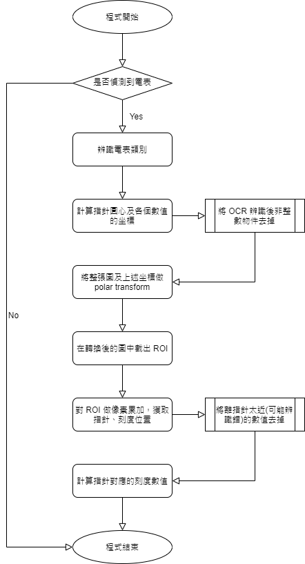
</p>

* ### YOLOv4 物件偵測
詳細程式碼建議至 TensorFlow 版 YOLOv4 的原專案查看 [tensorflow-yolov4-tflite](https://github.com/hunglc007/tensorflow-yolov4-tflite)
<p float="left">
  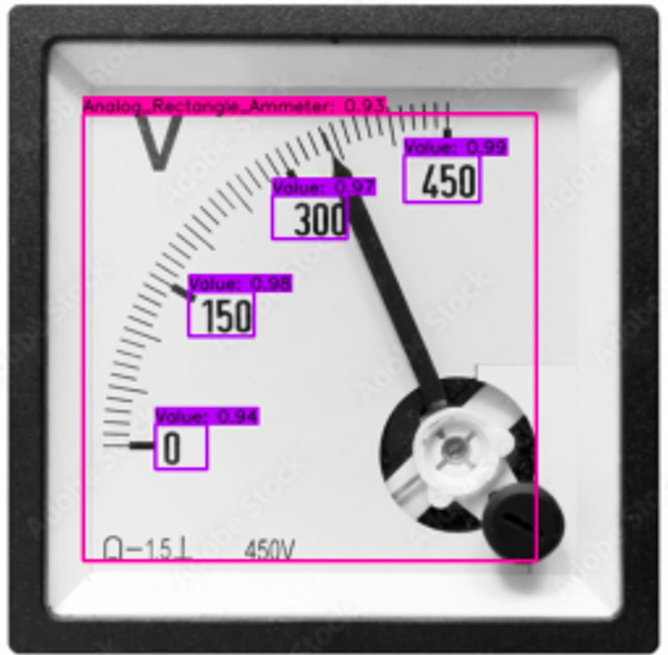
</p>

* ### 圓心計算
針對方形電表我們使用任三點取圓的方式來獲取圓心，任意三個數值物件的坐標帶入計算即可，而圓型電表則直接使用霍夫變換來偵測圓的外圍
<p float="left">
  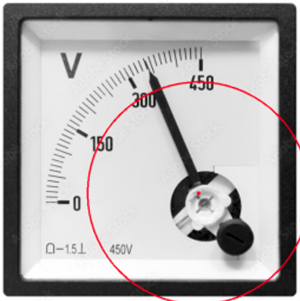
</p>

* ### 極坐標轉換
使用此方法的好處是可以將有刻度及指針的區域拉成直的，必須要先取得電表中指針的圓心，若圓心坐標誤差太大則會導致我們希望截取的區域過於扭曲
<p float="left">
  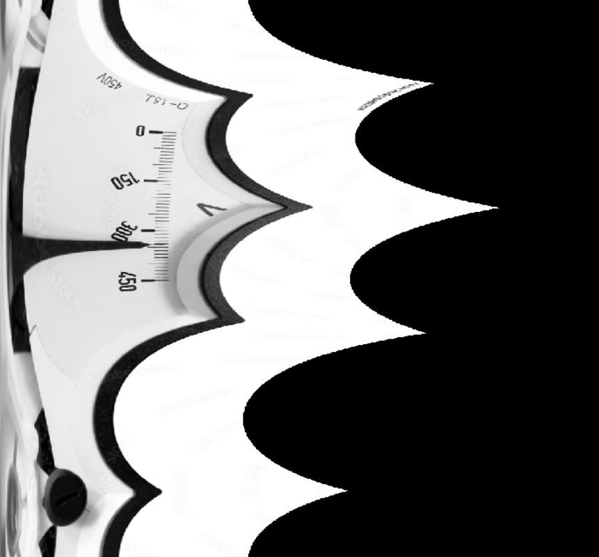
</p>

* ### 截取 ROI
透過物件偵測中數值物件的坐標，我們可以使用其及坐標轉換後對應的位置，截取出我們感興趣的區域(ROI)，並針對每個 ROI 計算哪一個 Row 的黑色 pixel 最多，則其為指針/刻度的位置
<p float="left">
  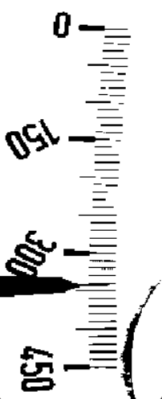
  &emsp;
  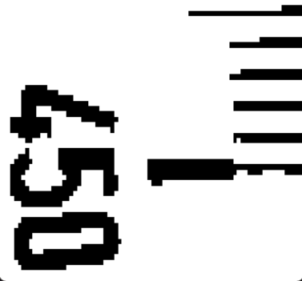
  &emsp;
  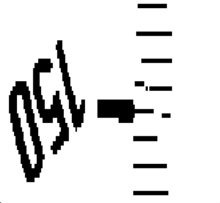
  &emsp;
  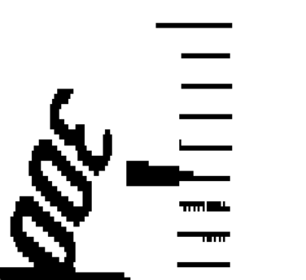
  &emsp;
  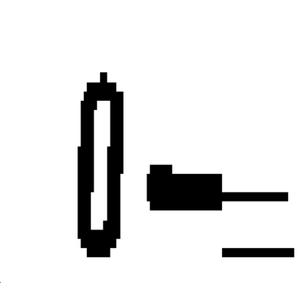
</p>

* ### 指針數值計算
在所有刻度中，我們以離指針最近的兩個去計算，根據其相對距離與跟指針的相對距離關係，就可以得出指針相對應的數值
<p float="left">
  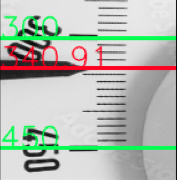
</p>

## 遭遇問題及困難
* 目前使用的 OCR library(pytesseract) 效果不甚理想，數字辨識錯誤會嚴重影響最終的結果
* 對電表中 pattern 處理的演算法彈性不大，仍須對不同型態的電表類別去設計
* 幾乎沒有真實場景中的電表資料，很難估計在光影等因素的影響下成效如何
* 些許情況下無法辨識，如有兩圈刻度的圓形電表，或是其他非常規顯示的電表


## 預計增加功能
* [ ] 將 python 程式碼轉至 Android
* [ ] 使用更精確的數字 OCR library
* [ ] 增加其他類型電表的辨識功能
* [ ] 即時偵測/辨識
* [ ] 輸入影像角度自動校正
