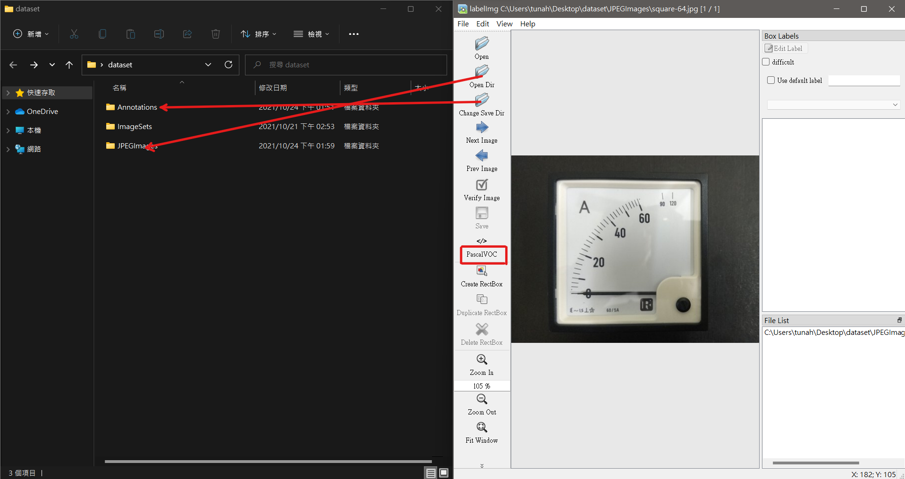
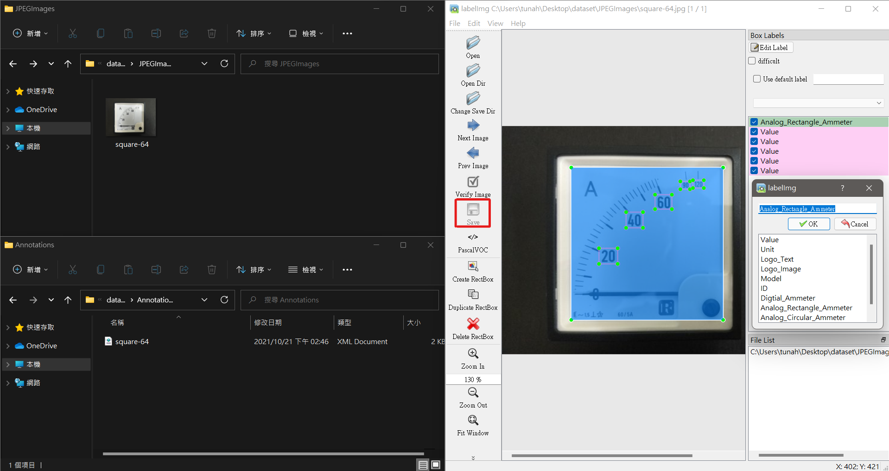

# LabelImg


## 安裝

* 下載並安裝 [Python](https://www.python.org/)
* 至[原專案](https://github.com/tzutalin/labelImg)複製專案資料夾，或直接使用本專案的備份
* 依以下指令安裝相關依賴

```
git clone https://github.com/tzutalin/labelImg.git
cd labelImg/

pip install pyqt5 lxml
pyrcc5 -o libs/resources.py resources.qrc
python labelImg.py
```


## 製作資料集

1. 創建 dataset 資料夾及、子資料夾及所需檔案，其中 JPEGImages/ 存放欲標記的圖檔 Annotations/ 存放標記檔案，其餘的會在產生 YOLO 格式訓練檔案時會用到

```bash
dataset/
├─Annotations/
├─ImageSets/
│  └─Main/
│          test.txt
│          train.txt
│          trainval.txt
│          val.txt
└─JPEGImages/
```

2. 修改 labelImg/data/predefined_classes.txt 中的內容為欲標記的類別
```
class1
class2
class3
.
.
.
```
3. 打開 LabelImg 開啟欲標記的資料集的資料夾，包括圖檔資料夾及標記檔資料夾，並將標記格式設為 PascalVOC

<p float="left">
  
</p>

4. 框選欲標記的物件，選好類別後點儲存按鈕，標記檔就會輸出至 Annotations/，檔名會與 JPEGImages/ 中的圖片相對應

<p float="left">
  
</p>

5. LabelImg 快捷鍵可以參考[原專案](https://github.com/tzutalin/labelImg#hotkeys)


# TensorFlow YOLOv4


## 安裝

* 至[原專案](https://github.com/hunglc007/tensorflow-yolov4-tflite)複製專案資料夾

* 下載預訓練模型 [yolov4.weight](https://drive.google.com/open?id=1cewMfusmPjYWbrnuJRuKhPMwRe_b9PaT) 並解壓至 tensorflow-yolov4-tflite/data/

* pip 安裝 requirements-gpu.txt 中的 python 套件，若沒有 Nvidia 顯卡則使用 requirements.txt

```bash
git clone git@github.com:hunglc007/tensorflow-yolov4-tflite.git
cd tensorflow-yolov4-tflite/

pip install -r requirements.txt
```


## 偵測

請先按照此 [issue](https://github.com/hunglc007/tensorflow-yolov4-tflite/issues/368) 更改 core/utils.py 的程式碼

```bash
# 將 Darknet 的權重轉為 TensorFlow 格式
## YOLOv4 
python save_model.py --weights ./data/yolov4.weights --output ./checkpoints/yolov4-416 --input_size 416 --model yolov4

## YOLOv4-tiny
python save_model.py --weights ./data/yolov4-tiny.weights --output ./checkpoints/yolov4-tiny-416 --input_size 416 --model yolov4 --tiny

# 測試 detect.py
python detect.py --weights ./checkpoints/yolov4-416 --size 416 --model yolov4 --image ./data/kite.jpg

python detect.py --weights ./checkpoints/yolov4-tiny-416 --size 416 --model yolov4 --image ./data/kite.jpg --tiny
```


## 模型訓練

1. 參考本專案的[模型訓練](https://github.com/tunahsu/meter-reader/#%E6%A8%A1%E5%9E%8B%E8%A8%93%E7%B7%B4)，將資料夾放入 data/ 中，執行本專案撰寫好的腳本，可至 meter-reader/scripts/voc/ 中取得，執行完畢後會得到以下資料夾及檔案

```bash
meter-reader/                                                                     
├─data/                        
│  ├─classes/                                                                  
│  │      dataset.names
│  └─dataset/                                                                  
│         dataset_train.txt                                           
│         dataset_val.txt  
```

2. 配置訓練參數 core/config.py

```
# 路徑
__C.YOLO.CLASSES              = "./data/classes/dataset.names"
__C.TRAIN.ANNOT_PATH          = "./data/dataset/dataset_train.txt"
__C.TEST.ANNOT_PATH           = "./data/dataset/dataset_val.txt"

.
.
.
# 其餘超參數依需求自行更改
__C.TRAIN.LR_INIT             = 1e-3
__C.TRAIN.LR_END              = 1e-6
__C.TRAIN.WARMUP_EPOCHS       = 2
__C.TRAIN.FISRT_STAGE_EPOCHS    = 20
__C.TRAIN.SECOND_STAGE_EPOCHS   = 30
.
.
.
```

3. 執行 train.py 開始訓練

```bash
# 從頭開始訓練
# core/config.py 中 FISRT_STAGE_EPOCHS = 0 
python train.py

# 遷移學習
python train.py --weights ./data/yolov4.weights
```

4. 訓練完後執行會在專案根目錄產生 checkpoints/ 資料夾，必須將其轉為 TensorFlow 的格式，在此之前先參照此 [issue](https://github.com/hunglc007/tensorflow-yolov4-tflite/issues/160) 更改 save_model.py

```
# utils.load_weights(model, FLAGS.weights, FLAGS.model, FLAGS.tiny)

# 替換成以下這行
model.load_weights(FLAGS.weights)
```

5. 接著執行 執行 save_model.py 及可得到 custom model 完成訓練的所有步驟

```bash
python save_model.py --weights ./checkpoints/yolov4 --output ./checkpoints/yolov4-your-model
```


##  模型轉換

想要在 Android 裝置上進行偵測，我們必須將模型轉為 TensorFlow Lite 的格式，在 save model 以及 detect 時命列參數 --framework 要設為 tflite

```bash
python save_model.py --weights ./checkpoints/yolov4 --output ./checkpoints/yolov4-416 --input_size 416 --model yolov4 --framework tflite

python convert_tflite.py --weights ./checkpoints/yolov4-416 --output ./checkpoints/yolov4-416.tflite

python detect.py --weights ./checkpoints/yolov4-416.tflite --size 416 --model yolov4 --image ./data/kite.jpg --framework tflite
```

詳細可參考[原專案](https://github.com/hunglc007/tensorflow-yolov4-tflite#convert-to-tflite)
